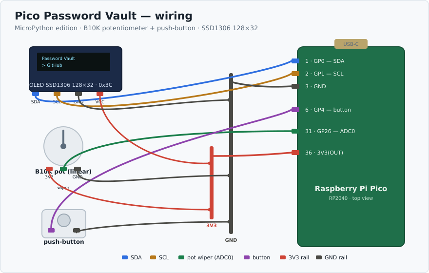

# MicroPython edition

The same vault as the parent project, rebuilt for **MicroPython** with a
**B10K potentiometer + push-button** instead of a rotary encoder. Runs on the
firmware this Pico already has — no reflashing to CircuitPython.

## Why this variant exists

- **Keeps MicroPython.** The board's OLED is already proven under MicroPython
  (SoftI2C), so there's nothing to reflash.
- **Pot, not encoder.** A B10K reads as an absolute position: turn to where an
  item sits and it highlights. A potentiometer has no button, so a separate
  momentary button does "select".

## Parts

| Part | Role |
| --- | --- |
| B10K linear potentiometer | navigate (absolute position -> menu index) |
| Momentary push-button | select / confirm / enter PIN |
| SSD1306 128x32 OLED | display (you have this) |
| Raspberry Pi Pico | the board |

## Wiring

| Signal | Pico pin | Label |
| --- | --- | --- |
| OLED SDA | 1 | `GP0` |
| OLED SCL | 2 | `GP1` |
| OLED GND | 3 | `GND` |
| OLED VCC | 36 | `3V3(OUT)` |
| Pot wiper | 31 | `GP26` / ADC0 |
| Pot end 1 | 36 | `3V3` |
| Pot end 2 | 38 | `GND` |
| Button leg 1 | 6 | `GP4` |
| Button leg 2 | 38 | `GND` |

If the menu moves the wrong way, swap the two pot end pins.



> **I²C runs at 100 kHz.** On breadboard jumpers the display is unreliable at 400 kHz (a scan false-ACKs every address); 100 kHz is solid. `vault.py` is set to 100 kHz.

## The two engineering points

**ADC noise needs hysteresis.** A raw `index = reading * n / full` flickers
between two items whenever the knob sits near a boundary. `pot_index()`
oversamples 16x and only commits to a new index once the reading is clearly
inside that item's slot (a quarter-slot dead-band). Verified in simulation:
holding on a boundary, the naive read flips 20 times in 40 samples; with
hysteresis, zero.

**A pot suits short lists.** Across ~270 degrees with ADC noise you get roughly
15-25 reliable positions. Fine for the database list and modest entry lists; a
single database with 40+ entries wants the encoder version instead.

## Install

MicroPython v1.23+ is required (for the runtime USB device support). Install the
HID driver once, host-side (works without Wi-Fi):

```bash
mpremote connect auto mip install usb-device-keyboard
```

Copy these to the board:

```bash
mpremote connect auto cp ssd1306.py hid.py boot.py \
  DB_Index.txt PIN.txt PWT_Demo.txt PWT_Bookmarks.txt :
mpremote connect auto cp vault.py :main.py   # so it runs on boot
```

`boot.py` starts the USB keyboard (one re-enumeration at power-on, keeping the
REPL and drive via `builtin_driver=True`). `main.py` runs the app.

> On the dev board with the stuck BOOTSEL button, `main.py` will not auto-start
> from a cold plug-in — boot it with `start.sh` from the pico-ssd1306-guide
> repo first. A healthy Pico auto-runs it.

## What's verified, and what isn't

Verified: the US keymap (all printable ASCII + Tab/newline, checked on the
board against known HID usage IDs), the pot hysteresis (simulation), menu
paging, and that the HID keyboard enumerates on the host.

Not verified without the hardware and a person present: actual keystrokes
landing in a host text field (that has to be typed into a real field, not a
headless session), and the pot + button themselves. Test typing into a plain
text editor first, never a live login, until you trust it.

## Security

Unchanged from the parent project: plaintext files behind a PIN, no encryption.
See the parent README.
